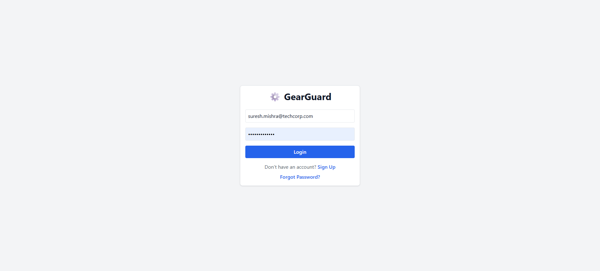
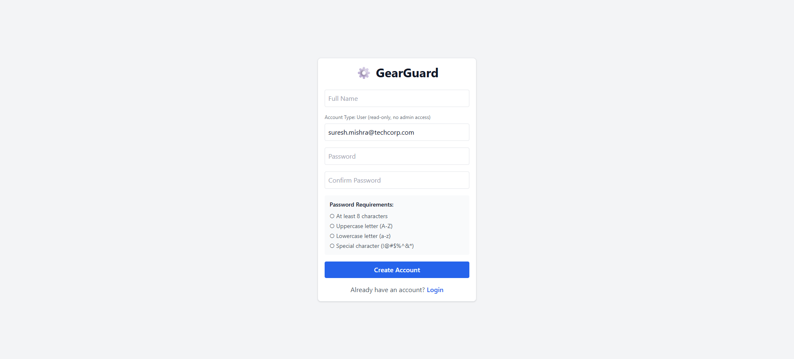
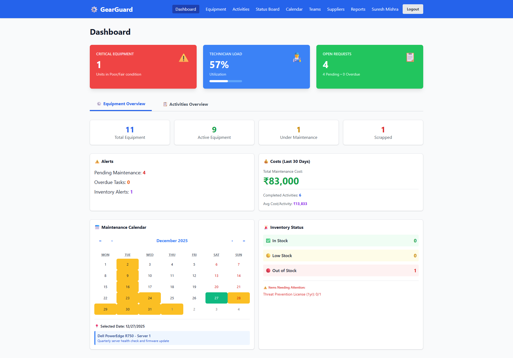
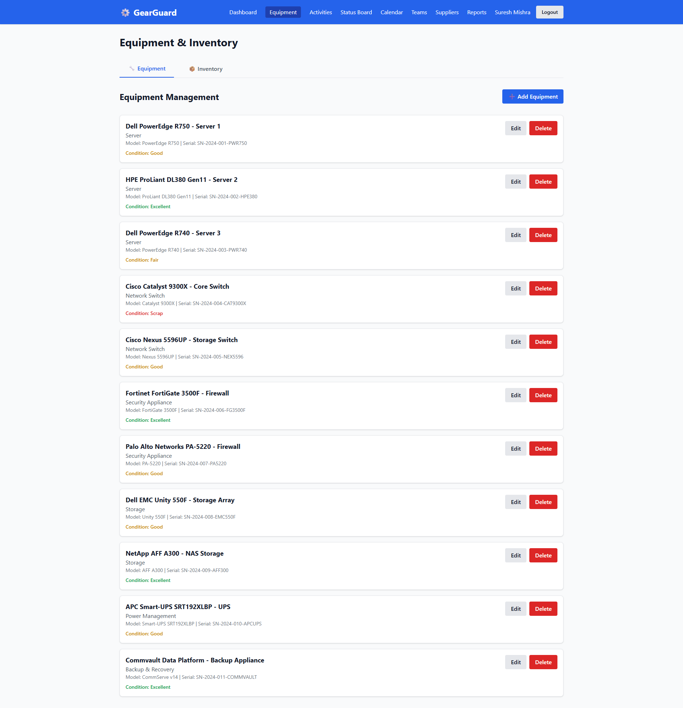
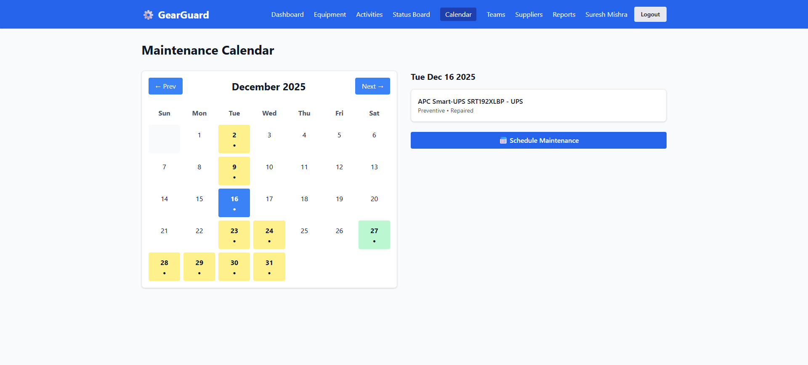

# ⚙️ GearGuard – Equipment Maintenance Management System

GearGuard is a web-based **equipment maintenance and inventory management system** built using the **MERN stack**. It helps organizations track assets, manage maintenance tasks, monitor inventory, and coordinate teams efficiently.

---

## 🖼️ Screenshots

> Screenshots are stored in the `Screenshots` folder.

### 🔐 Authentication



### 📊 Dashboard & Activity



### 📅 Calendar


---

## 🎯 Overview

GearGuard helps you:
- Track equipment and IT assets
- Schedule preventive and corrective maintenance
- Manage inventory and spare parts
- Assign teams and technicians
- Monitor suppliers
- Visualize tasks using a Kanban board
- Get real-time updates via WebSockets

**Status:** ✅ Production Ready  
**Version:** 1.0.0  

---

## ✨ Key Features

- 📊 **Dashboard** – Equipment status, maintenance overview, alerts  
- 🖥️ **Equipment Management** – Assets, condition, status, history  
- 🔧 **Maintenance Tracking** – Preventive & corrective tasks  
- 📦 **Inventory Management** – Stock levels and low-stock alerts  
- 👥 **Team Management** – Technician teams and assignments  
- 🏢 **Supplier Management** – Vendor tracking  
- 🎯 **Kanban Board** – Drag-and-drop workflow  
- 📅 **Calendar View** – Maintenance scheduling  
- 📈 **Reports** – Maintenance and cost summaries  

---

## 🏗️ Tech Stack

### Frontend
- React + Vite
- Tailwind CSS
- Axios
- Chart.js
- Socket.io Client

### Backend
- Node.js
- Express
- MongoDB (Mongoose)
- JWT Authentication
- Socket.io

---

## 👤 User Roles

- **Admin** – Full access  
- **Technician** – Maintenance & equipment access  
- **Viewer** – Read-only access  

---

## 📁 Project Structure

```
GearGuard/
├── backend/
│   ├── src/models
│   ├── src/controllers
│   ├── src/routes
│   └── server.js
├── frontend/
│   ├── src/pages
│   ├── src/components
│   └── src/App.jsx
├── Screenshots/
│   ├── Calendar.png
│   ├── Activities.png
│   ├── dashboard.png
│   ├── signin.png
│   └── signup.png
└── README.md
```

---

## 🚀 Installation

### Prerequisites
- Node.js (v16+)
- MongoDB
- npm

---

### Backend Setup

```bash
cd backend
npm install
npm run dev
```

Create `.env`:
```env
MONGODB_URI=mongodb://localhost:27017/gearguard
JWT_SECRET=your_secret_key
PORT=5000
FRONTEND_URL=http://localhost:5173
```

---

### Frontend Setup

```bash
cd frontend
npm install
npm run dev
```

Create `.env`:
```env
VITE_API_URL=http://localhost:5000/api
```

---

## 🔐 Authentication & Security

- JWT-based authentication
- Password hashing with bcrypt
- Role-based access control
- Protected API routes

---

## 📌 Purpose

GearGuard centralizes **equipment, maintenance, and inventory management** to reduce downtime and improve operational visibility.
